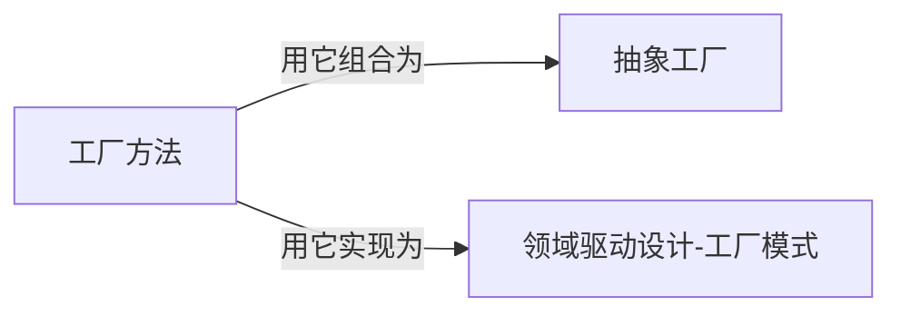

# 工厂方法

## 1 什么是工厂方法（Factory Method）

工厂方法提供了一个将对象的创建委托给子类的接口，解决了在不暴露对象创建逻辑的情况下，让子类决定实例化哪个类的问题。

## 2 问题（Problem）

### 2.1 意图（Intent）

定义一个用于创建对象的接口，让子类决定实例化哪一个类。FctoryMethod使一个类的实例化延迟到其子类。

### 2.2 动机（Motivation）

在软件开发中，有时候我们需要根据不同的条件创建不同的对象，但是如果将对象的创建逻辑直接放在客户端代码中，会使得代码变得冗长且难以维护。
因此
我们可以使用工厂方法模式，通过定义一个创建对象的接口，由子类来决定具体创建哪个对象。

### 2.3 适用性（Applicability）

- 一个系统要独立于它的产品的创建、组合和表示时。
- 一个系统要由多个产品系列中的一个来配置时。
- 当你要强调一系列相关的产品对象的设计以便进行联合使用时。
- 当你提供一个产品类库，而只想显示它们的接口而不是实现时。
- 如果不是多个模型组成

## 3 解决方案（Solution）

### 3.1 结构图（Structural Diagram）

#### 3.1.1 网络结构图

使用图论的复杂网络分析方法分析解决方案的组成元素的网络结构

#### 3.1.2 UML结构图

### 3.2 参与者（Participants）

- **产品（Product）**
  
    定义工厂方法所创建产品的接口
    
- **具体产品（ConcreteProduct）**
  
    实现产品定义
    
- **工厂（Factory）**
  
	声明一个工厂方法（接口），使它能返回产品类型的对象。
  
- **具体工厂（ConcreteFactory）**
  
    实现这个工厂方法

### 3.3 协作（Collaborations）

## 4 效果（Consequence）

优势
- 工厂方法分离了模型的创建过程和表示形式，可以支持模型的不同表示形式及其关联的不同创建过程。
- 提供了可扩展新的创建过程。
- 减少了类的层级。当一个类将它的职责委托另外一个独立的类时候，就产生了平行类层次。工厂方法连接了模型类和它的创建类（AbstractFactory），使得它们在类层次上是平行的。创建类的具体实现返回的是一个模型的默认实例（Model）。
劣势
- 可能仅仅为了创建一个特定的具体模型对象，不得不创建工厂类。当工厂不是必须的时候，客户必然要处理类演化的奇特地方。

## 5 相关模式（Related Patterns）

## 6 实践（Practice）

### 6.1 代码案例

- [Java](./source-codes/java/)
- [Python(待补充)](./source-codes/python/)
- [Rust(待补充)](./source-codes/rust/)
- [C++(待补充)](./source-codes/cpp/)

